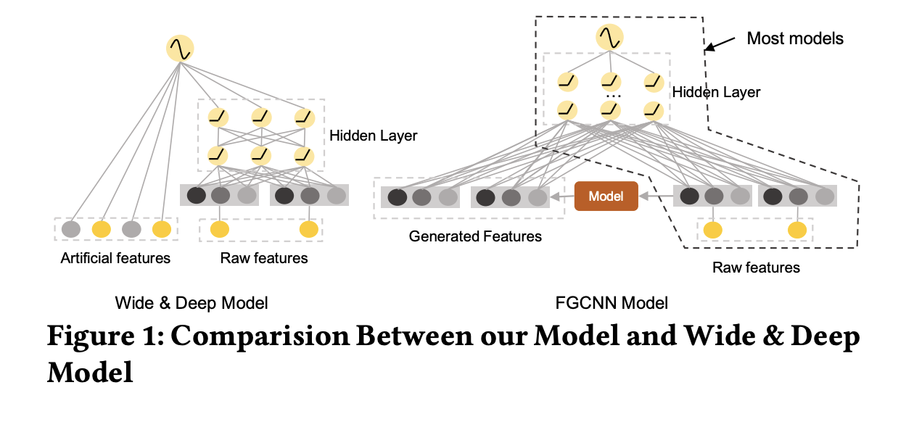
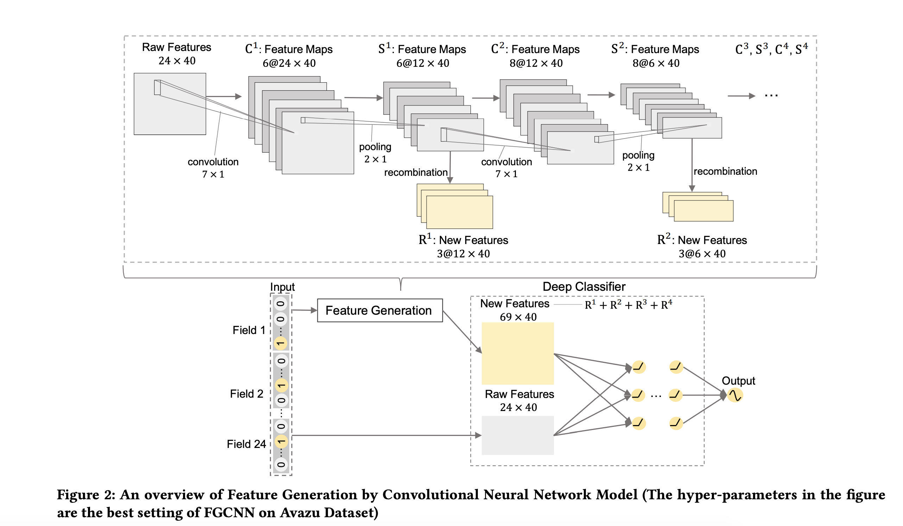
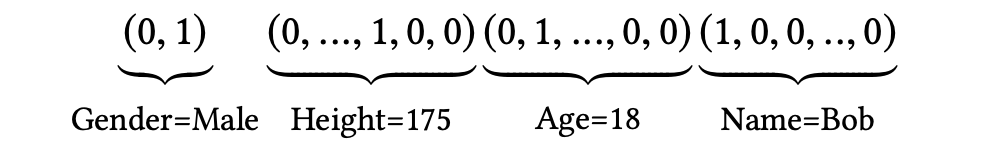
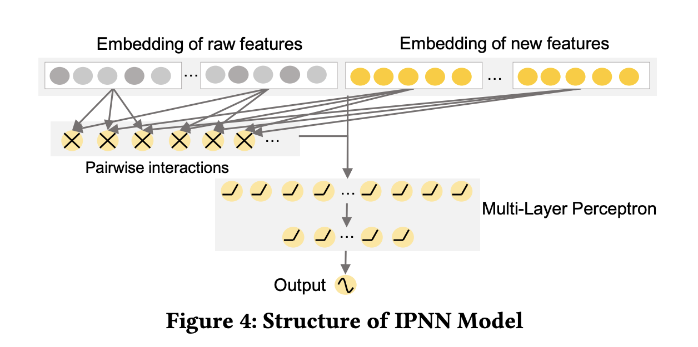
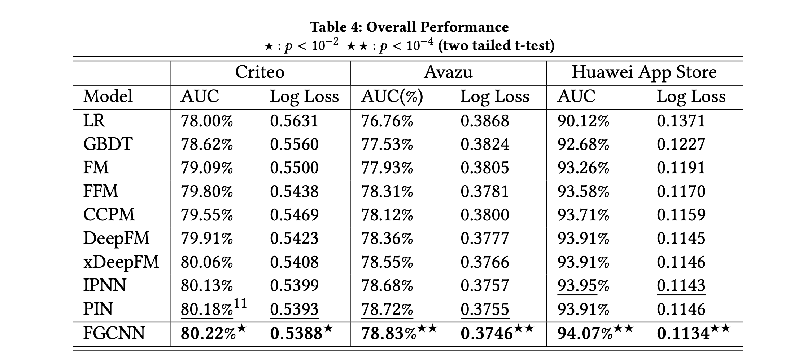

# FGCNN 
> Implementation of Feature Generation by Convolutional Neural Networks using `fast.ai`.


Abstract taken from [paper](https://arxiv.org/abs/1904.04447)
> Click-Through Rate prediction is an important task in recommender systems, which aims to estimate the probability of a user to click on a given item. Recently, many deep models have been proposed to learn low-order and high-order feature interactions from original features. However, since useful interactions are always sparse, it is difficult for DNN to learn them effectively under a large number of parameters. In real scenarios, artificial features are able to improve the performance of deep models (such as Wide & Deep Learning), but feature engineering is expensive and requires domain knowledge, making it impractical in different scenarios. Therefore, it is necessary to augment feature space automatically. In this paper, We propose a novel Feature Generation by Convolutional Neural Network (FGCNN) model with two components:Feature Generation and Deep Classifier. Feature Generation leverages the strength of CNN to generate local patterns and recombine them to generate new features. Deep Classifier adopts the structure of IPNN to learn interactions from the augmented feature space. Experimental results on three large-scale datasets show that FGCNN significantly outperforms nine state-of-the-art models. Moreover, when applying some state-of-the-art models as Deep Classifier, better performance is always achieved, showing the great compatibility of our FGCNN model. This work explores a novel direction for CTR predictions: it is quite useful to reduce the learning difficulties of DNN by automatically identifying important features.

- Extracting effective and efficient features for this task is very expensive and requires domain expertise.
- This work proposes to use FGCNN ( Feature Generation by CNN ) to solve this problem.
- CNN is used to extract local patterns which are then combined to generate new features.



- It is difficult for DNN to learn feature interactions because these are very sparse. e.g. suppose we want to calculate the probablity of a user downloading a game given features like `age`, `country`, `gender`, `city` and turns out that only `age` and `country` are useful in predicting the outcome variable and rest is noise. It becomes very hard for DNN to learn that embeddings for `country` and `city` must be `0`.

- CNN alone cannot solve this problem because there is no transitional invariance among the features ( `age`, `gender`, `country`, `city` ) is similar to ( `age`, `gender`, `city`, `country` ), so that is why the author has proposed to use CNNs with MLPs as shown in the following figure



### Input dataset requirements

- For most of the ctr prediction tasks, data is collected in the form of `multi-field` categorical form such that each feature could be transformed into high dimensional sparse ( binary ) vector via one hot encoding as an example.
- For example, (Gender=Male, Height=175, Age=18, Name=Bob) can be represented as:



### Model structure

- Feature Embedding Layer : Every categorical field is passed through an embedding layer before passing to feature generation module.
- Feature Generation Layer: ( CNN + Recombination ) layer. CNN extracts useful neighbor patterns and recombination layer generates global feature interactions.
- Deep Classifier Layer: IPNN model shown below



**We could use any custom model ( FM, DNN, IPNN, DeepFM etc. ) in the deep classifier layer based on the task at hand.**

### Loss Function


### Experiments



**We have tried to use the [Avazu]() dataset for our experiments.**

## Install

`pip install git+https://github.com/numb3r33/fgcnn.git`

## How to use

```python
#slow


# prepare data loaders
dls     = get_dl()

# prepare embedding matrix
emb_szs = get_emb_sz(dls.train_ds, k=40) # `k` - embedding_size ( 40 ) mentioned in the paper for this dataset.

# prepare model architecture
m = FGCNN(emb_szs=emb_szs, 
             conv_kernels=[14, 16, 18, 20], 
             kernels=[3, 3, 3, 3],
             dense_layers=[4096, 2048, 1024, 512],
             h=7,
             hp=2
            )

# create tabular learner
learn = TabularLearner(dls, m, loss_func=BCELossFlat(), opt_func=ranger)

# train and validate
learn = train(dls, m, lr, loss_func=BCELossFlat(), n_epochs=1)
```
